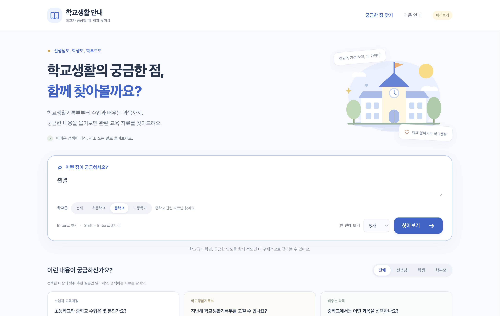
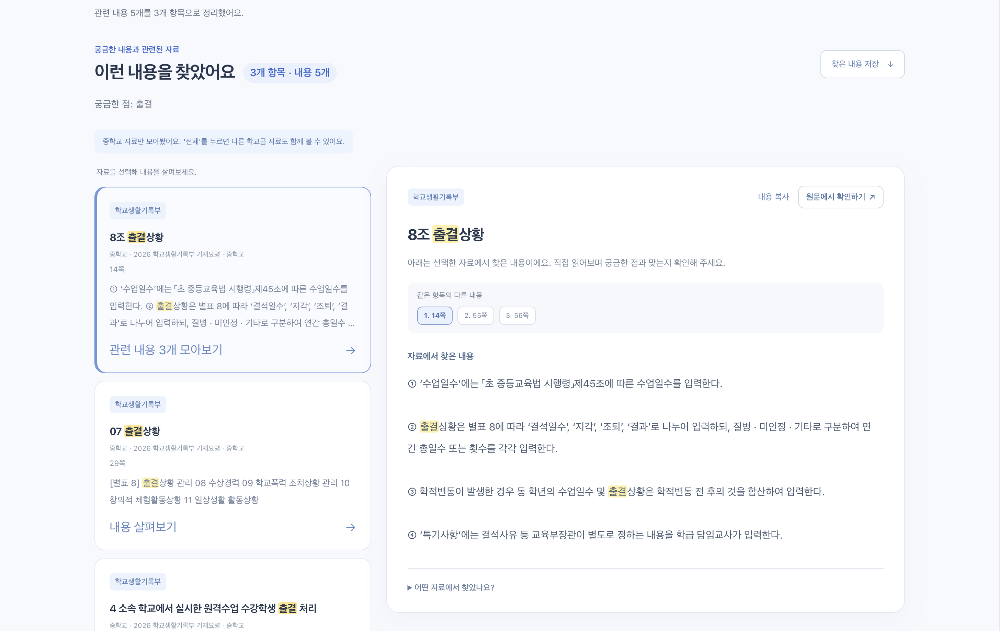

# llm-edu-rag

[](https://github.com/CHUSEOYOUNG/llm-edu-rag/actions/workflows/tests.yml)

교육부 PDF는 분량이 길고 비슷한 표현이 여러 학교급 문서에 반복된다. 필요한 내용을 찾을 때마다 PDF 전체를 넘겨보는 불편을 줄여보려고 만든 교육 문서 검색 프로젝트다.

현재는 **로컬 검색, 원문 확인, 선택형 답변 생성**까지 사용할 수 있다. BGE-m3로 관련 내용을 찾고 PDF 페이지를 바로 열 수 있으며, 필요할 때만 Ollama의 Qwen3 4B 모델로 답변을 정리한다. 검색과 생성 모두 로컬에서 실행해 API 사용료가 들지 않는다.

지금 색인에는 학교생활기록부 기재요령과 교육과정 자료 6개, 총 1,331개 청크가 들어 있다.

## 화면

질문을 입력하면 학교급을 구분해 관련 교육 자료를 찾는다.



같은 항목에서 나온 내용은 한 카드로 묶고, 검색어가 포함된 부분과 원문 페이지를 함께 보여준다.



## 지금 구현된 기능

- 자연어 질문과 `출결` 같은 짧은 키워드 검색
- `그럼 중학교는?`처럼 직전 질문을 이어 묻는 검색
- 최근 질문을 PostgreSQL에 저장하고 브라우저별 다시 찾기·전체 삭제
- 초등학교·중학교·고등학교 자료 필터
- 같은 문서의 같은 항목에서 나온 결과 묶기
- 검색어 강조, 표 정리, PDF 추출용 HTML 흔적 제거
- 관련성이 낮은 결과에 질문을 구체화하라는 검토 안내
- 학교별 급식·행사·마감일 질문에 학교 안내를 함께 확인하라는 범위 안내
- 원문 PDF 페이지 표시 및 해당 페이지 바로 열기
- `자료로 답변 만들기`를 눌렀을 때만 실행되는 로컬 Qwen3 답변 생성
- 답변 문장에 사용된 출처 ID와 인용문이 실제 검색 원문에 있는지 검사
- 선택한 내용 복사와 텍스트 파일 저장
- 출처 ID와 원문 인용을 검사하는 RAG 파이프라인
- FastAPI 검색 API, OpenAPI 문서, 상태 확인 경로
- Spring Boot 애플리케이션 백엔드와 PostgreSQL 검색 이력 저장
- 비루트 사용자와 읽기 전용 마운트를 적용한 Docker/Compose 구성
- 구조 기반·overlap·고정 길이 청킹 비교 실험
- multilingual CrossEncoder reranker 비교 실험
- BGE-M3 벡터와 본문 metadata를 저장하는 Qdrant 영속 로컬 색인

웹 화면에는 검색 점수나 청크 ID 대신 항목 이름, 학교급, 페이지처럼 실제로 자료를 확인할 때 필요한 정보만 보여준다.

## 검색 구조

```text
PDF
 └─ 페이지별 텍스트 추출
     └─ 문서 구조에 따라 section / chunk 생성
         └─ BGE-m3 임베딩
             └─ Dense 검색
                 └─ 학교급 필터와 짧은 키워드 재정렬
                     ├─ 원문 내용과 PDF 페이지 표시
                     └─ 선택 시 Ollama Qwen3 → 인용 검사 → 답변 표시
```

기본 검색은 **질문 원문 → BGE-m3 Dense → body-only index** 순서다. 문서 경로는 검색 벡터에 섞지 않고 결과 설명과 출처 표시에만 쓴다.

이렇게 정한 이유는 실험 결과가 단순했다. 경로와 본문을 함께 임베딩했을 때보다 본문만 사용했을 때 R@5가 `0.659 → 0.750`, MRR@20이 `0.697 → 0.777`로 올랐다. BM25와 결합한 RRF도 R@5는 같았지만 순위 품질이 Dense보다 좋아지지 않아 현재 기본값은 Dense로 두었다.

짧은 검색어는 예외다. `출결`처럼 단어 한두 개만 입력하면 Dense 상위 후보 안에서 항목 이름과 학교급의 문자 일치를 한 번 더 본다. 이 보정은 웹 화면에만 적용하며 CLI 평가의 Dense 순서는 바꾸지 않는다.

## 실행

Python 3.12 이상과 [uv](https://docs.astral.sh/uv/)가 필요하다. 화면 JavaScript 테스트까지 실행하려면 Node.js도 필요하다. 원문 PDF, 처리된 청크, 임베딩 파일과 로컬 BGE-m3 모델 캐시는 저장소에 포함하지 않았다. 처음부터 색인을 만드는 과정은 [데이터 준비 문서](data/README.md)에 정리했다.

### 웹 화면

답변 만들기를 사용하려면 [Ollama](https://ollama.com/download)를 설치하고 Instruct 모델을 한 번 받아 둔다. Thinking 태그는 사고 과정을 길게 출력하므로 이 화면에서는 사용하지 않는다.

```sh
ollama pull qwen3:4b-instruct
```

Ollama를 실행한 뒤 검색 서버를 시작한다.

```sh
uv run python src/search_app.py
```

브라우저에서 <http://127.0.0.1:8765/>를 연다. 포트가 이미 사용 중이면 다른 포트를 지정할 수 있다.

```sh
uv run python src/search_app.py --port 8766
```

화면과 검색 API는 FastAPI와 Uvicorn으로 실행된다. 현재는 `127.0.0.1`에만 바인딩하며, Ollama도 같은 컴퓨터의 `127.0.0.1:11434`로만 호출한다. 모델을 바꾸려면 `OLLAMA_MODEL` 환경 변수를 설정할 수 있다.

### 검색 API

서버를 실행하면 API 문서는 <http://127.0.0.1:8765/docs>, OpenAPI 스키마는 <http://127.0.0.1:8765/openapi.json>에서 확인할 수 있다.

```sh
curl http://127.0.0.1:8765/health

curl -X POST http://127.0.0.1:8765/api/search \
  -H 'Content-Type: application/json' \
  -d '{"question":"중학교 출결","top_k":3,"school_level":"middle"}'

curl -X POST http://127.0.0.1:8765/api/search \
  -H 'Content-Type: application/json' \
  -d '{"question":"그럼 중학교는?","previous_question":"초등학교 수업 한 시간은 몇 분인가요?","top_k":3,"school_level":"middle"}'

curl -X POST http://127.0.0.1:8765/api/answer \
  -H 'Content-Type: application/json' \
  -d '{"question":"중학교 수업 한 시간은 몇 분인가요?","top_k":2,"school_level":"middle"}'
```

검색 요청은 `question`, `top_k`, `school_level`과 선택 항목인 `previous_question`을 받는다. `그럼`, `그러면`, `중학교는?`처럼 이어 묻는 표현일 때만 직전 질문의 주제를 검색문에 보충한다. FastAPI 자체는 대화 기록을 저장하지 않으며 응답의 `search_query`와 `follow_up_applied`에서 실제 검색문과 적용 여부를 확인할 수 있다. `/api/search`는 생성 모델을 호출하지 않는다. `/api/answer`는 같은 항목의 중복 조각을 정리한 대표 원문 하나를 사용하고, 비교 질문만 최대 두 자료를 사용한다. `몇 분`, `몇 일` 같은 단순 수치 질문은 해당 단위가 있는 완전한 문단 하나만 전달한다. `result_assessment`는 검색 결과를 한 번 더 확인해야 하는지 알려주지만, 질문에 답할 수 있는지를 확정하지는 않는다.

### Docker

Docker 이미지에는 원문 PDF, 임베딩, BGE-m3 모델을 넣지 않는다. 저장소에서 만든 `data/raw`, `data/processed`와 사용자 홈의 Hugging Face 캐시를 읽기 전용으로 연결한다. 따라서 먼저 [데이터 준비](data/README.md)를 마쳐야 한다.

```sh
docker compose up --build
```

준비가 끝나면 <http://127.0.0.1:8765/>에서 화면을 열고 상태를 확인한다.

```sh
curl http://127.0.0.1:8765/health
docker compose down
```

Compose는 호스트의 `127.0.0.1`에만 포트를 공개한다. 기본 컨테이너는 호스트 Ollama에 접근하지 않도록 `OLLAMA_ENABLED=0`으로 두어 검색만 제공한다. BGE-m3를 기본 위치가 아닌 다른 Hugging Face 캐시에 저장했다면 `compose.yaml`의 모델 캐시 마운트 경로를 그 위치에 맞춰야 한다. 첫 이미지 빌드는 PyTorch 등 실행 의존성을 설치하므로 시간과 디스크 공간이 필요하다.

### CLI 검색

```sh
uv run python src/rag.py \
  "생기부 글자수 셀 때 한글 한 글자는 몇 바이트로 계산되나요?" \
  --output runs/retrieval.json
```

터미널에는 각 결과의 일부만 출력하고, 전체 본문과 문서명·구조 경로·PDF 페이지는 JSON에 저장한다. `runs/`는 Git에서 제외한다.

### 테스트

```sh
uv run python -m unittest discover -s tests -v
node --test tests/test_presentation.cjs
cd backend && ./gradlew test
```

현재 Python 테스트 107개, JavaScript 테스트 12개, Spring Boot 테스트 4개를 둔다. FastAPI 요청 스키마와 OpenAPI 문서, 정적 파일 제공, 잘못된 요청 차단, 학교급 필터, 직전 질문을 잇는 검색, 최근 질문 저장, PDF 페이지 연결, 깨진 표 표시, 로컬 생성 요청 분리, 잘못된 인용 차단, 생성 컨텍스트 축소 시 학교급 보존, 답변 가능 여부 평가셋 분리, Qdrant 색인 재로딩, Spring 컨텍스트와 FastAPI 프록시 계약, 컨테이너 구성의 주요 안전 조건도 테스트에 포함되어 있다. GitHub Actions는 같은 검사와 CPU 전용 Docker 이미지 빌드를 실행한다.

## 검색 실험

초기 개발 질문 11개로 body-only 검색기를 비교한 결과다.

| 방식 | R@1 | R@5 | R@10 | MRR@20 |
|---|---:|---:|---:|---:|
| BM25 | 0.273 | 0.523 | 0.750 | 0.495 |
| Dense | 0.523 | 0.750 | 0.750 | 0.777 |
| RRF | 0.523 | 0.750 | 0.750 | 0.773 |

이 수치는 작은 개발셋에서 얻은 값이라 최종 성능으로 보기는 어렵다. 같은 질문으로 설정을 고르고 점수도 냈기 때문에 탐색 결과로만 사용했다.

같은 11개 질문과 17개 근거 그룹으로 청킹 방식도 비교했다. 모델과 질문, body-only 색인은 그대로 두고 청크 경계만 바꿨다.

| 청킹 방식 | 청크 수 | 색인 문자 수 | Complete@5 | Coverage@5 | MRR@20 |
|---|---:|---:|---:|---:|---:|
| 구조 기반(현재) | 1,331 | 791,399 | **0.818** | **0.818** | 0.636 |
| 구조 기반 + 앞 문맥 200자 | 1,331 | 939,551 | 0.636 | 0.682 | **0.667** |
| 섹션 내 고정 800자 | 1,316 | 793,072 | 0.727 | 0.727 | 0.582 |

overlap은 첫 근거의 순위를 일부 높였지만 top-5에서 두 질문이 회귀했고 색인할 문자 수도 약 19% 늘었다. 고정 800자 방식도 현재 구조 기반 방식보다 Complete@5가 낮았다. 따라서 기본 청킹은 구조 기반 방식을 유지한다. 세 방식 모두 주석한 17개 근거 그룹을 새 청크에 다시 연결할 수 있는지 확인한 뒤 평가했다.

Dense top-20을 `BAAI/bge-reranker-v2-m3`로 재정렬하는 실험에서는 MRR@20이 `0.636 → 0.700`, Complete@10이 `0.818 → 0.909`로 올랐다. 하지만 Complete@5는 `0.818`로 같았고 한 질문을 회복하는 대신 다른 질문 하나가 회귀했다. 로컬 CPU에서 질문당 평균 12.8초가 걸려 현재 검색 화면에는 적용하지 않았다.

답변 가능 여부를 Dense 최고 점수 하나로 구분할 수 있는지도 확인했다. 개발 질문 13개에서 ROC-AUC는 `0.818`이었고, `0.61`을 기준으로 했을 때 답할 수 있는 질문 11개 중 9개를 높은 관련성으로 표시했다. 코퍼스에 없는 질문 2개는 모두 검토 대상으로 분류됐다. 다만 답할 수 있는 질문 2개도 함께 검토 대상으로 내려갔고, 라벨이 없는 질문에 대한 성능은 알 수 없다. 그래서 이 기준으로 결과를 없애거나 답변 불가라고 단정하지 않고, 질문을 구체화하고 원문을 확인하라는 안내만 보여준다.

이후 답변 가능 16개와 불가능 16개로 질문을 늘리고 개발셋과 테스트셋을 절반씩 분리했다. 개발셋에서만 고른 기준 `0.617`을 테스트셋에 적용한 결과 ROC-AUC는 `0.891`, Balanced Accuracy는 `0.812`였다. 답변 가능 질문 8개 중 6개를 강한 후보로 표시했고, 답변 불가능 질문 8개 중 7개에 검토 안내를 표시했다. 기존 서비스 기준 `0.610`도 테스트 결과가 같아서 변경하지 않았다.

점수만으로 놓친 `우리 학교 전학 신청 마감일`을 분석해 학교별 급식·행사·상담·마감일 표현을 별도 범위 신호로 추가했다. 점수와 범위 신호를 함께 사용하면 테스트 Balanced Accuracy가 `0.812 → 0.875`, Specificity가 `0.875 → 1.000`으로 올랐고 Recall은 `0.750`으로 유지됐다. 이 경우에도 결과를 없애지 않고 학교 홈페이지나 가정통신문을 함께 확인하라는 안내만 보여준다.

동일한 Dense 벡터를 Qdrant 영속 로컬 저장소에도 넣어 비교했다. 내용 기준 top-20과 검색 평가 지표는 NumPy와 같았다. 1,331개 규모에서 평균 검색 시간은 NumPy 0.143ms, Qdrant 로컬 2.473ms였고 저장 공간은 각각 9.09MiB와 15.28MiB였다. 현재 화면은 더 단순하고 빠른 NumPy를 계속 사용하며 Qdrant는 향후 서버 배포를 위한 선택 백엔드로 둔다.

이후에는 같은 답을 뒷받침하는 여러 판본을 하나의 근거 그룹으로 묶어 평가 규칙을 다시 정리했다. 현재 v2 개발셋에서 원문 질문 Dense의 Complete@5는 `9/11`이다. 질문을 손으로 줄이면 `10/11`까지 올라갔지만 한 질문의 정답 근거가 2위에서 10위로 내려가는 회귀가 있어 기본 검색에는 반영하지 않았다.

자세한 조건과 질문별 결과는 아래 기록에 남겨두었다.

- [Fusion 재검증](notes/2026-08-27-fusion-audit.md)
- [검색문 표현 비교](notes/2026-08-27-query-expression.md)
- [평가셋 v2 감사](notes/2026-08-27-eval-v2-audit.md)
- [청킹 방식 비교](notes/2026-09-02-chunking-ablation.md)
- [CrossEncoder reranker 비교](notes/2026-09-02-reranker-ablation.md)
- [NumPy와 Qdrant 비교](notes/2026-09-02-vector-store-ablation.md)
- [FastAPI 검색 API 전환](notes/2026-09-02-fastapi-migration.md)
- [Docker 실행 구성](notes/2026-09-02-docker.md)
- [답변 가능 여부 점수 기준 실험](notes/2026-09-07-answerability-baseline.md)
- [답변 가능 여부 개발/테스트 분리 평가](notes/2026-09-08-answerability-split.md)
- [직전 질문을 잇는 검색](notes/2026-09-08-follow-up-search.md)
- [Ollama 로컬 답변 생성](notes/2026-09-09-local-generation.md)
- [로컬 답변 생성 지연 개선](notes/2026-09-10-generation-latency.md)

## 답변 생성 코드

웹 화면은 `src/ollama_generate.py`를 통해 로컬 `qwen3:4b-instruct`를 호출한다. 검색 결과를 출처 ID와 함께 넘기고, 생성된 문장에 사용된 인용이 실제 원문에 존재하는지 검사한다. 검사를 통과해도 의미상 정확한 답이라고 확정하지 않고 `draft_answer`로 다룬다. 이 기능에는 API 키나 호출 요금이 없다.

`src/rag_generate.py`의 OpenAI Responses API 연결부는 비교 실험용으로 남겨 두었다. 아래 CLI에서 `--generate`를 명시한 경우에만 외부 API를 호출한다.

```sh
uv run --env-file .env python src/rag.py \
  "생기부 글자수 셀 때 한글 한 글자는 몇 바이트로 계산되나요?" \
  --generate \
  --output runs/answer.json
```

이 명령은 질문과 검색된 문서 내용을 외부 API로 보내며 비용이 발생할 수 있다.

## Spring Boot와 PostgreSQL

IntelliJ에서 애플리케이션 백엔드를 개발하고 PostgreSQL을 DBeaver로 확인할 수 있는 구성을 `backend/`에 분리했다. Spring Boot는 사용자 요청과 검색 기록을 담당하고, 모델 로딩과 검색·답변 생성은 기존 FastAPI가 계속 담당한다. Java에서 임베딩과 PyTorch 코드를 다시 구현하지 않으면서 일반적인 서비스 백엔드 구조를 보여주기 위한 분리다.

실행 순서와 DBeaver 연결 정보는 [백엔드 개발 안내](backend/README.md)에 정리했다.

## 폴더 구성

```text
src/          파싱, 청킹, 검색, 평가, RAG 코드
web/          로컬 검색 화면
tests/        Python / JavaScript 테스트
eval/         평가 질문, 근거 주석, 고정 스냅샷
experiments/  실험 결과 JSON
notes/        실험 과정과 실패 분석
config/       현재 Dense 색인의 설정과 파일 지문
backend/      Spring Boot API, JPA, Flyway
Dockerfile    FastAPI 검색 서비스 이미지
compose.yaml  로컬 데이터와 모델 캐시를 연결하는 실행 구성
compose.dev.yaml  로컬 PostgreSQL 개발 환경
```

## 남은 작업

- 평가 질문을 늘리고 개발셋과 테스트셋 분리
- 문서 연도와 개정 이력을 이용한 적용 시점 확인
- 답변 가능 여부 평가셋 독립 검토와 학교별 일정 질문의 범위 판별
- 생성 답변 평가셋 구축과 정확성·보류율 측정
- Docker 설치 환경에서 이미지 빌드·상태 확인 실제 검증
- 배포용 Qdrant 서버 구성

지금 화면이 보여주는 것은 질문과 가까운 **원문 일부**다. 학교급이나 시행일이 검색어와 일치하더라도 실제 적용 여부까지 자동으로 판단하지는 않는다. 이 부분은 검색 정확도와 별개로 계속 확인할 예정이다.
